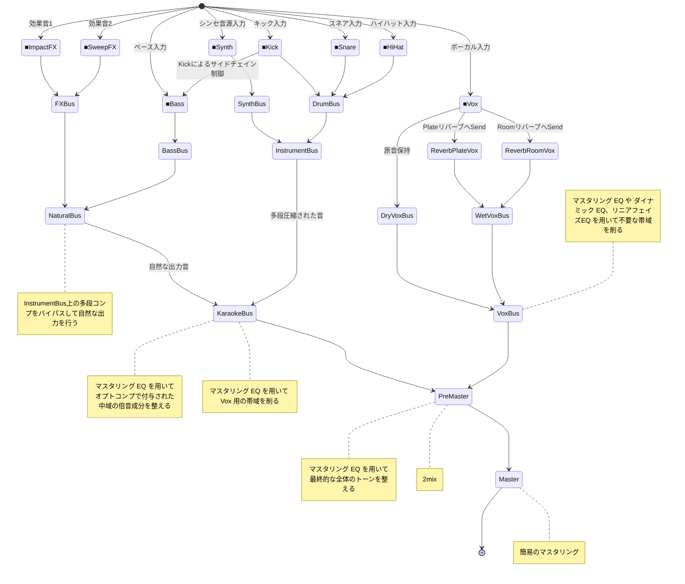

# 汎用的なミキシング・アーキテクチャ

## コンセプト
- 圧縮した音源に対して、原音やセンドリバーブをマージすることでトランジェントの復活、自然な空気感の演出を行う目的があります。
- すべての Bus には「オプトコンプ」が挿入させており、多段式にコンプレッションすることで、自然なピークリダクションを狙っています。
- 自然に目立たせたい音は多段式コンプレッションをバイパスしています (例：FX や WetVox)
- InstrumentBus、もしくはそこに集まるBusの音の特性上、アタックが強いがトランジェントが少なく、ブリックウォール・リミッターを用いてピークを下げてください。
  - 但し、聴覚上、極端な音の変化が変わる場合は行わないでください。あくまでピークを下げることを目的としてください。

## ダイアグラム

