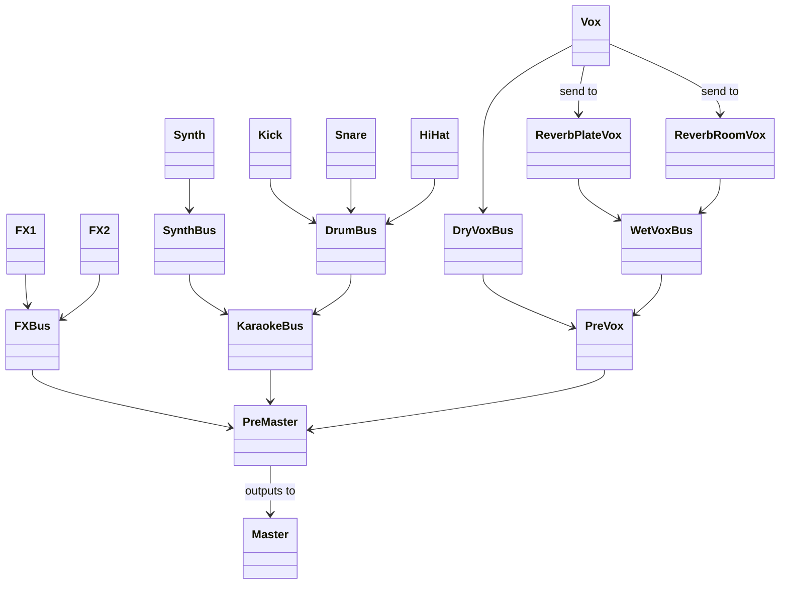

## コンセプト
- すべての Bus には「オプトコンプ」が挿入させており、多段式にコンプレッションする前提
- 自然に目立たせたい音は多段式コンプレッションをパイパスしている (例：FX や WetVox)

```mermaid
classDiagram
    class Kick
    class Snare
    class HiHat
    class Synth
    class FX1
    class FX2
    class Vox

    class ReverbPlateVox
    class ReverbRoomVox

    class SynthBus
    class DrumBus
    class FXBus
    class DryVoxBus
    class WetVoxBus
    class KaraokeBus

    class PreVox
    class PreMaster
    class Master

    %% Routing: Instrument → Buses
    Synth --> SynthBus
    Kick --> DrumBus
    Snare --> DrumBus
    HiHat --> DrumBus
    FX1 --> FXBus
    FX2 --> FXBus
    Vox --> DryVoxBus
    Vox --> ReverbPlateVox : send to
    Vox --> ReverbRoomVox : send to

    %% Reverbs → Wet Vox Bus
    ReverbPlateVox --> WetVoxBus
    ReverbRoomVox --> WetVoxBus

    %% Buses → Karaoke Bus
    SynthBus --> KaraokeBus
    DrumBus --> KaraokeBus

    %% Vox routing
    DryVoxBus --> PreVox
    WetVoxBus --> PreVox

    %% Pre buses
    FXBus --> PreMaster
    KaraokeBus --> PreMaster
    PreVox --> PreMaster

    %% Final output
    PreMaster --> Master : outputs to
```

