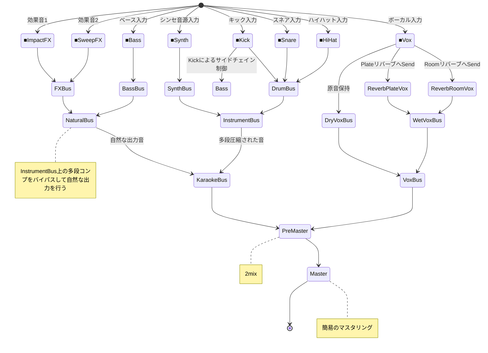

# 汎用的なミキシング・アーキテクチャ

## コンセプト
- 圧縮した音源に対して、原音やセンドリバーブをマージすることでトランジェントを復活させる目的があります
- すべての Bus には「オプトコンプ」が挿入させており、多段式にコンプレッションすることで、自然なピークリダクションを狙っています。
- 自然に目立たせたい音は多段式コンプレッションをパイパスしています (例：FX や WetVox)

